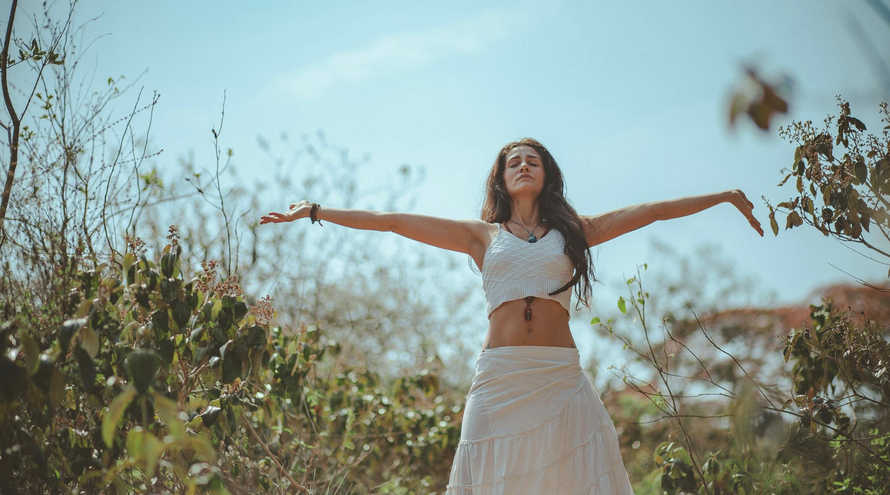
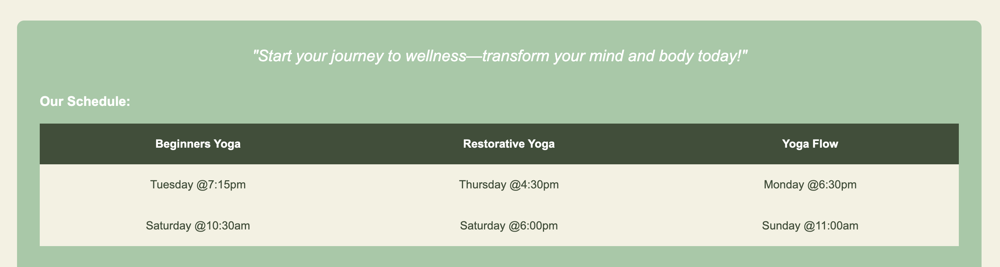
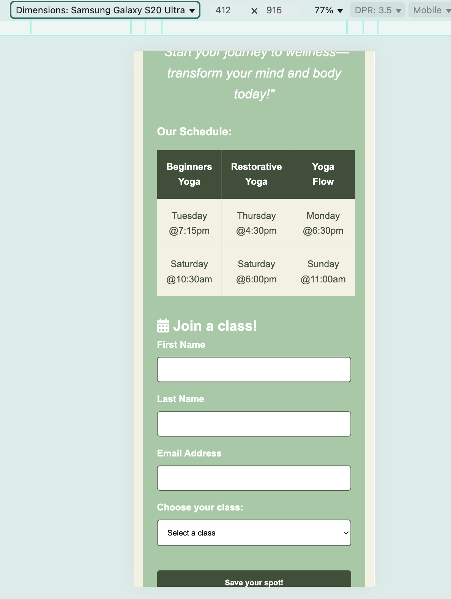

# The Calm Cove: A Front-end Website Project:

## Table of Contents

1. [Overview](#overview)
2. [UX Goals](#ux-goals)
3. [Target Audience](#target-audience)
4. [Visual Design](#visual-design)
5. [Key Features](#key-features)
6. [Technology Stack](#technology-stack)
7. [Testing](#testing)
8. [Deployment](#deployment)
9. [Credits](#credits)
10. [Contact](#contact)

---

## Overview

The Calm Cove is a wellness center located in Bath, Somerset, focused on providing yoga and meditation classes to promote relaxation, tranquility, and personal growth. This website serves as an online presence for the center, offering information about their services, class schedules, and contact details. The site features clear navigation, a welcoming introduction, and a simple class booking form to help users join yoga sessions easily, as well as offer an array of ways to contact the studio.

---

## UX Goals

The primary UX goals for The Calm Cove website are:

- **Welcoming User Experience:** Use calming visuals and language to create an inviting atmosphere.
- **Intuitive Navigation:** Make navigation simple so users can quickly find key sections like classes and contact info.
- **Engaging Visual Design:** Use cohesive design elements that reflect the calming wellness brand.
- **Accessible Information:** Organize content clearly and ensure all info is easy to find and read.
- **Clear Call-to-Actions:** Place clear, action-driven buttons throughout the site to guide user behavior.
- **Simple Class Registration:** Make the sign-up form easy to use with clear instructions and a visible CTA button.
- **Easy-to-Find Location Information:** Include an interactive map and easy-to-locate contact details.
- **Mobile Responsiveness:** Ensure the site works smoothly across all devices with responsive design.

---

## Target Audience

The target audience for The Calm Cove website includes:

- **Yoga Beginners:** Individuals new to yoga or returning after a break who are seeking a gentle introduction to yoga practices.
- **Wellness Enthusiasts:** People interested in improving their physical, mental, and emotional well-being through yoga, meditation, and mindfulness.
- **Local Residents of Bath, Somerset:** Individuals living in or near Bath who are looking for a nearby wellness center to join yoga classes or engage in relaxation practices.
- **Busy Professionals:** People looking for stress relief, relaxation, and balance in their lives, often seeking restorative yoga or mindfulness practices to counteract work-related stress.
- **Health-Conscious Individuals:** Those focused on personal development, energy healing, and holistic practices for overall wellness and mental peace.

Overall, this audience is looking for a calming and accessible environment to unwind, develop their yoga practice, and find tranquility in their daily lives.

---
## Visual Design

The design theme for The Calm Cove was intentionally crafted to reflect the core values of grounding, balance, and calmness — central concepts in wellness and yoga. The choice of colors and overall aesthetic was carefully selected to evoke feelings of tranquility, connection to nature, and inner peace.

**Color Palette**:

The colors used in the design were chosen to mirror the neutral, earthy tones of the natural world. By incorporating shades that you would find in the earth, plants, and nature, the design promotes a sense of calm and serenity:

- Dark Olive Green (#3E4E38): This rich, earthy green symbolizes stability and grounding. It reflects the solid, dependable foundation of the earth and serves to create a calm, anchored environment for the user. Green is also a color associated with nature, renewal, and healing, making it a perfect fit for a wellness-oriented brand.
- Soft Sage Green (#A1C9A5): This light, muted green represents balance and harmony. It evokes feelings of relaxation and emotional peace, encouraging the viewer to feel at ease and welcomed.
- Off-White (#F4F1E1) and White (#FFFFFF): These neutral tones provide a clean and open space, allowing the other colors to breathe and preventing the design from feeling too busy or overwhelming. White is often associated with purity, simplicity, and clarity, fostering a sense of peace and focus. It also enhances readability, ensuring that all the information on the website is easy to access and absorb.

**Design Elements and Layout:**

The layout was designed to flow naturally and intuitively, with the content structured to guide the user effortlessly through the website. This reflects the organic nature of wellness — simple, yet intentional design that aligns with natural movements and rhythms. The flexible grid system ensures that elements are aligned symmetrically, while also adapting fluidly to various screen sizes.

The rounded corners on images and buttons echo the soft, organic shapes of nature, avoiding harsh angles or rigid lines that might disrupt the calming vibe.
The white space between sections allows for mental breathing room, creating a sense of spaciousness and tranquility, akin to the openness found in a peaceful natural setting. This is how the deployed version of this website has turned out visually:

 
 
 
 
 

There is room for improvements especially around the 'What We Offer' section. This section of the CSS code would need extra time with to make sure the flexbox method is used more effectively to better the placement of the elements. At the moment the different types of classes on offer are in a list that has inconsistent font size and placement in relation to other elements in it's section. 

**Text and Typography:**

The use of Arial for the font reflects a modern, simple, and clean design, ensuring that content is accessible without distraction. The font choice is unobtrusive, aligning with the idea of a space that promotes focus and reflection.

**Logo:**

The Calm Cove logo was created using Canva, utilizing a pre-generated template that matched the brand's tranquil and organic theme. The white color was chosen for its simplicity and to align with the clean, minimalist design of the website.

The logo's subtle design ensures it doesn’t overwhelm users while maintaining brand recognition. This choice complements the white header, creating a cohesive, peaceful aesthetic that enhances the user experience without distraction.

**Images:**

Website's imagery plays a crucial role in reinforcing the natural, grounding atmosphere of the website. The images were carefully selected to evoke a sense of warmth, comfort, and calm, immersing users in the peaceful world of The Calm Cove.

- Welcome Image: The welcoming image is intentionally chosen to convey a positive, warm, and inviting atmosphere. The earthy tones in the image — with its soft, natural hues — enhance the calming effect and make visitors feel at ease. The figure of the woman with open arms symbolically invites visitors to embrace the site, creating a sense of welcome and belonging. This image is designed to make users feel as though they are being embraced into the community, reflecting the open-hearted nature of the wellness journey offered by the brand.

- Meditation Pose Image: The meditation pose photo carries the same organic tones and peaceful vibe. It includes candles and incense burning in the lower left corner, which visually evokes a feeling of warmth, coziness, and serenity. This imagery contributes to the sense of tranquility and calmness that the brand aims to create, reinforcing the theme of wellness, mindfulness, and inner peace.

---
## Key Features:

- Welcome Page: A welcoming homepage with the Calm Cove logo and an inviting photo that sets a peaceful, calming tone.

- Navigation Bar: Easy-to-use interactive navigation bar with clear links to sections of the website for smooth user experience.

- What We Offer Section: Displays a description of services with an accompanying photo to visually support the offerings.

- Timetable: A structured timetable showcasing class schedules for easy access and planning. Also features a motivational hero line and call to action, encouraging users to take the next step towards joining the community.

- Sign-Up Form: An interactive form with a dropdown selector for users to choose the class they want to save spot for.

- Find Us Section: Google Map integration to visually guide users to the physical location, with a contact section for inquiries.

- Footer with Social Media Links: Footer includes social media links to stay connected with users and promote the brand’s online presence.

---
## Technology Stack

- **Languages used:**

  - **HTML5**: The foundational structure of this web design is built using HTML5, ensuring semantic markup for accessibility and search engine optimisation.
  - **CSS3**: Styling is done using CSS3, with responsive design achieved using media queries. 

- **Libraries:** 
    - _Font Awesome:_ Provides scalable vector icons for UI elements like social media links.
    - _Google Maps Embed API:_ Embedded for easy location viewing of the wellness center.

-**Platforms:**

- _GitHub:_ Used for version control and deployment.
- _GitPod:_ Initial cloud-based IDE for development.
- _VSCode:_ Local IDE for development with front-end extensions.

- **Other:**

    - _Favicon Generator:_ Used to create a custom favicon for the website representing a meditation pose which relates to the theme of yoga practices and wellness. 
    - _Canva Online Tool_: Used by myself to create the websites logo using a pre-available template from the website that matches the general theme I was going for. 
    - _HTML Color Picker_: I originally used a pre-generated color pallete from Coolors, however, as the project was developed I decided to change the colors to my own picks. For this I have searched using this online tool to generate the hex codes used. 

---
## Testing

- **Validation**:

  - HTML has been validated with the W3C HTML5 Validator. There was 1 error message for HTML code to remove the "alt" tag from the iframe Google Maps link. Once this was removed, the HTML validator showed there was no errors left.
  
  

  - CSS has been successfully validated with the W3C CSS Validator. Links checked with https://validator.w3.org/checklink (W3C Link Checker).
  

- **Testing Platforms**:

  - The project was mainly tested using the Chrome Browsers Dev Tools feature which displayed mostly everything as expected, across different devices to test responsiveness.
  - Unfortunately, due to time constraints, I was not able to personally test the project across a wider range of devices. This is an area I would suggest for improvement in the future, as thorough cross-device testing would help ensure a more seamless experience for users on various platforms.
  - I was, however, able to test this project’s functionality across different browsers such as Firefox, Safari and Edge using LambdaTest. (Source: https://app.lambdatest.com/console/realtime/browser/desktop.) This test confirmed the successful functionality of this project across all these browsers with no bugs or compromises in fast performance.

-  **Issues Found:**

The design is largely responsive and has been tested across a range of devices, including small phones, medium devices, tablets, and desktops. In most cases, the responsive design functions as expected. However, there are a couple of issues on specific phones. On devices like the Samsung Galaxy S8 Plus, the timetable section overflows beyond its container, and for devices such as the Samsung Z Fold 5, the margin on the right side appears misaligned and out of proportion. These issues are relatively minor in the grand scheme of the design but would require further refinement. Unfortunately, due to time constraints, I was unable to resolve this issue within the project timeline, but it remains a top-task for future development.

- **Accessability**:

Using Chrome DevTools' Lighthouse tool, the website achieved solid performance scores across multiple categories. The performance score of 96 indicates optimized load times and strong overall performance. The accessibility score of 96 ensures the site is easy to navigate for a broad range of users, providing an intuitive and inclusive experience. The website also received a perfect 100 in both SEO and Best Practices, demonstrating excellent search engine optimization and adherence to modern web standards, prioritizing security and reliability. These scores were consistent across both mobile and desktop versions. Overall, the project scored highly across key metrics, indicating a well-rounded, functional, and optimized website.

---

## Deployment

This project was deployed via GitHub. Follow the steps below to deploy:

1. Log in to your GitHub account and navigate to [GitHub Repository](https://github.com/PaulinaD-CodeIns/the-calm-cove-project).
2. Fork or clone the repository.
3. Push to a new repository using `git add`, `git commit`, and `git push`.
4. Go to Settings > GitHub Pages and select the "Master" branch as the source.
5. Wait a few moments for the site to go live. View the live version [here](https://paulinad-codeins.github.io/the-calm-cove-project/).

This project has been deployed for over 2 months and has been used as the main way for me to check for changes and errors.

_(Note: Not my own instruction content, please see credits)_

---

## Credits

1. **Content Generator:** Initially, the content for the website was based on a combination of materials and inspiration gathered from Robyn's Yoga Studio in Bath. The original content, which can be found at Robyn's Yoga Studio, served as a starting point, providing real-life descriptions and information relevant to the yoga center's offerings and philosophy. However, to tailor the content to The Calm Cove and its unique identity, several sections were revised and enhanced. To align the content with The Calm Cove's brand voice and avoid copyright infringement, I used ChatGPT 4.0 for AI-assisted content generation. This tool helped refine the language, clarify messaging, and maintain a calming, welcoming tone that reflects the wellness-centered ethos of the studio, ensuring consistency, clarity, and accessibility throughout the site. Sources: https://chatgpt.com/ and https://www.robynsyoga.co.uk/.

2. **Background Image:** To source the mediation pose photo I have used Pexels. The source of the welcome image has not been recorded anywhere and when trying to look for it using Google Images search there is no exact matches to where this image has come from. Instead, the search shows other websites where this image has been used so it is very possible that I have found this photo and took a screenshot of it from the third party website. This site source is also unknown. 

3. **README.md Structure:** The structure of this README document follows a model example shared by my mentor. The instructions for GitHub deployment are directly referenced from this source. Source:https://github.com/Ri-Dearg/horizon-photo/blob/main/README.md#mobile-testing.

---

## Contact

Feel free to fork the repository, make changes, and submit pull requests. Suggestions for improvements are welcome!

For more information, contact me at: [paulid4628@gmail.com](mailto:paulid4628@gmail.com)
GitHub username: PaulinaD-CodeIns
